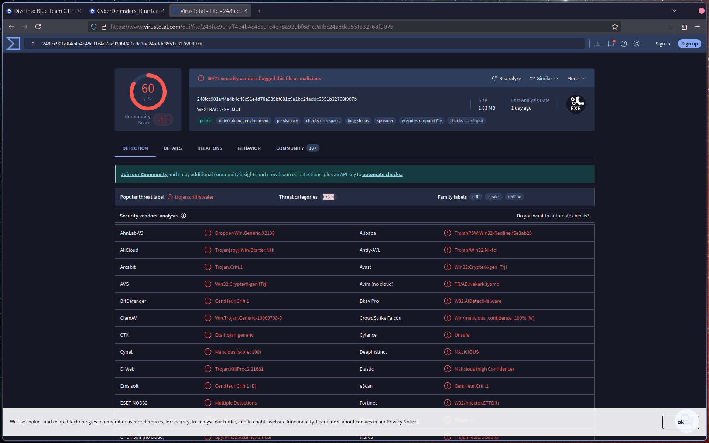
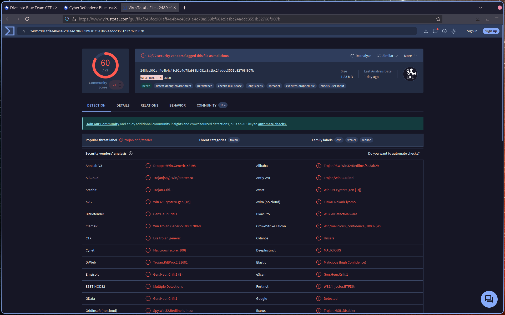
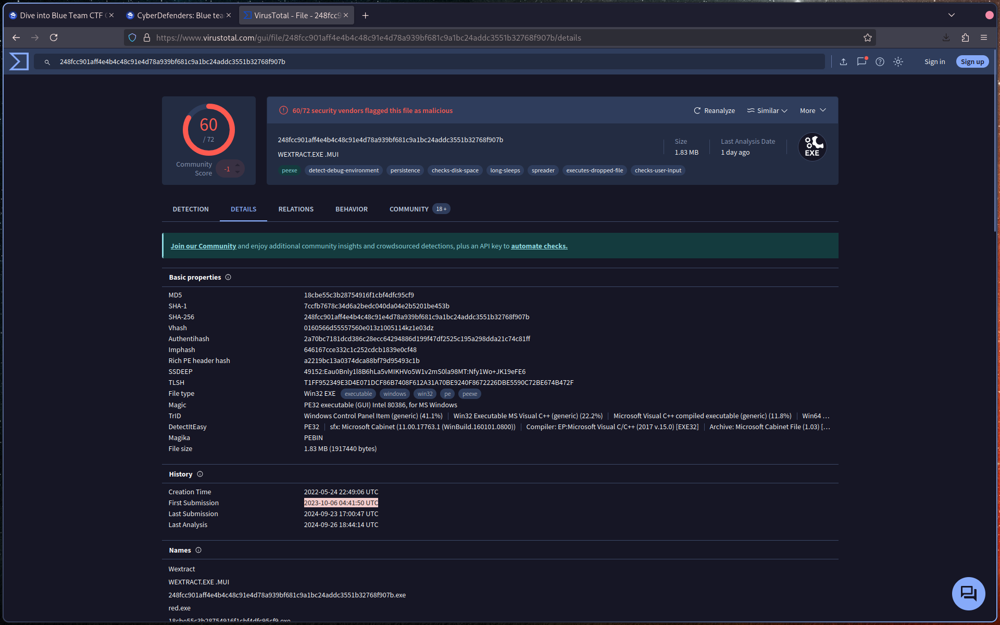
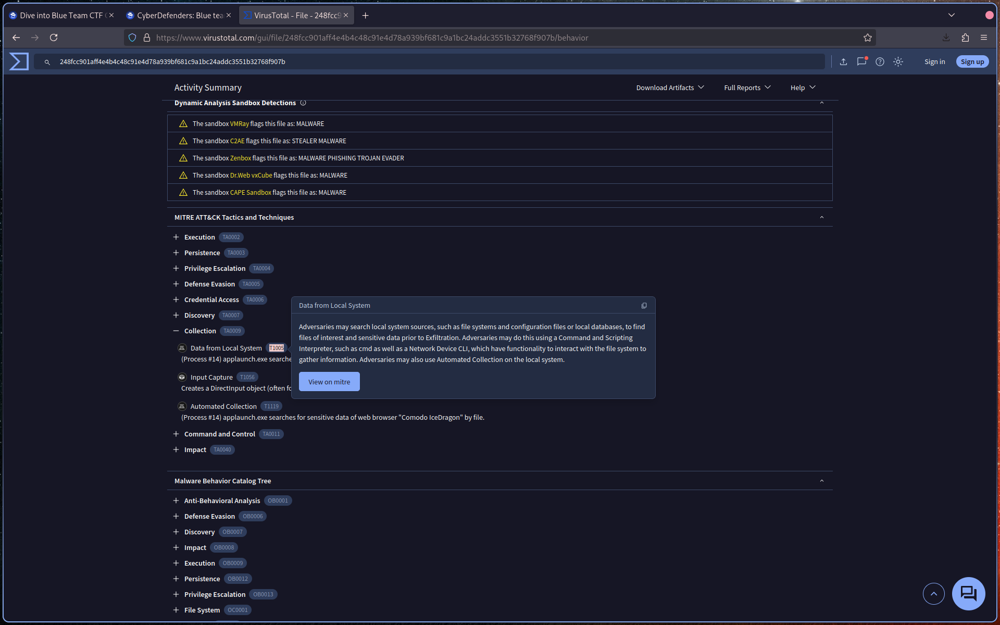
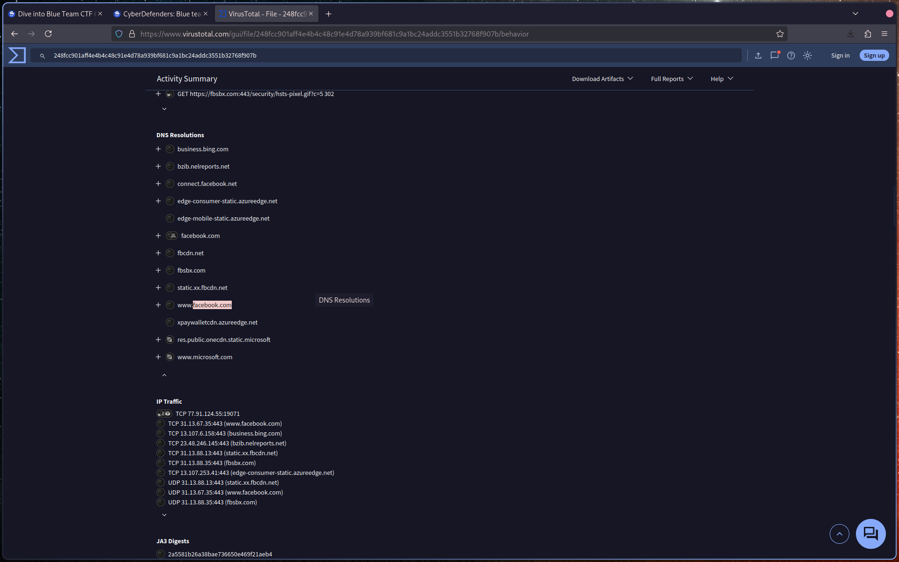
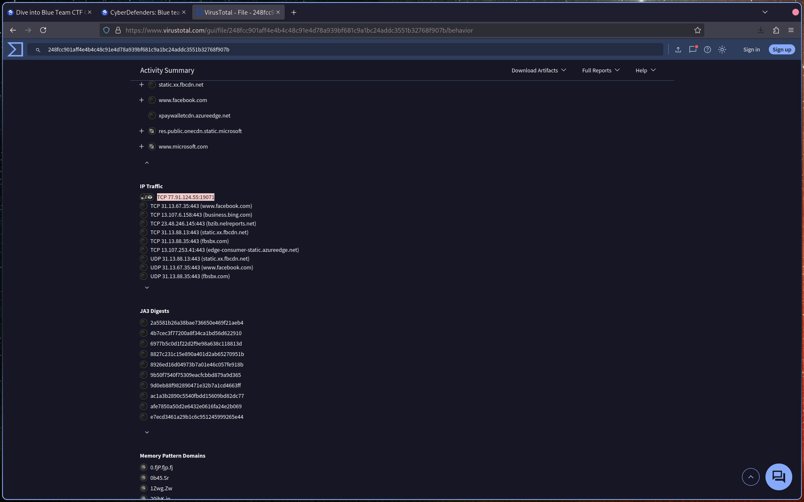
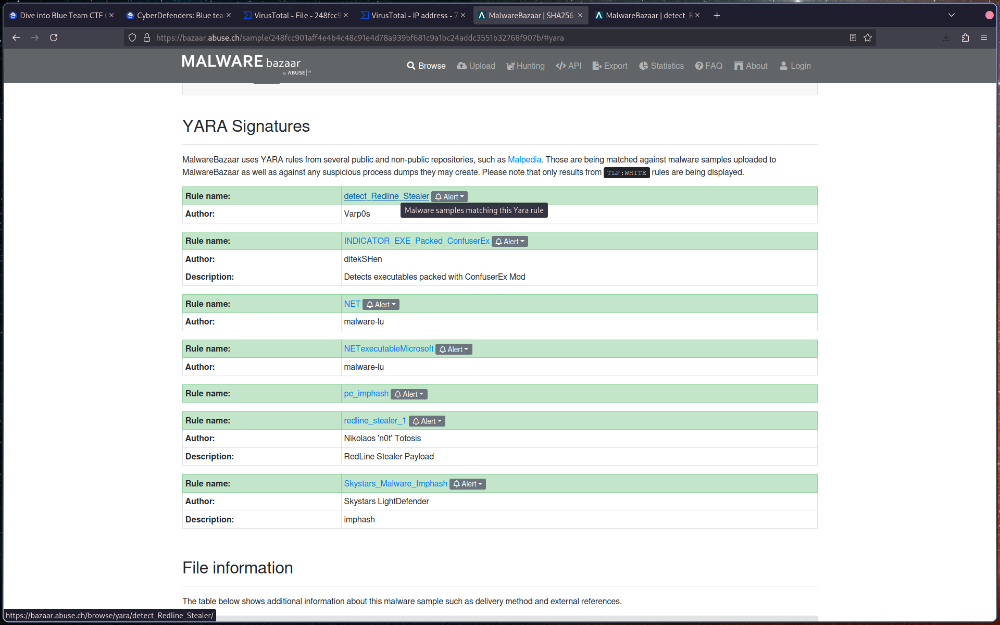
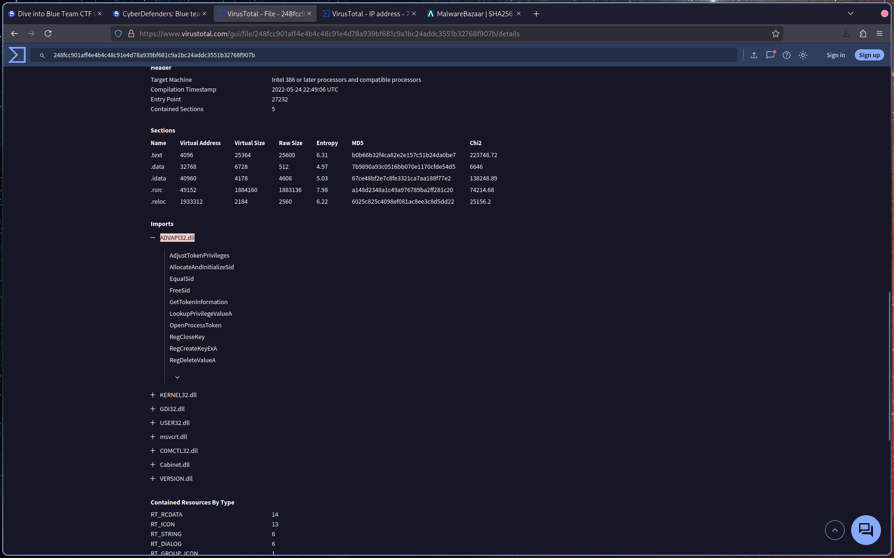

# Introduction

Tools recommended by the author, it's important:

- Whois
- VirusTotal
- MalwareBazaar
- ThreatFox

# Q1: Categorizing malware allows for a quicker and easier understanding of the malware, aiding in understanding its distinct behaviors and attack vectors. What's the identified malware's category?

Let's enter the hash in VT :

# Q2: Clear identification of the malware file name facilitates better communication among the SOC team. What's the file name associated with this malware?

In the main detection tab we have the file name too :

# Q3: Knowing the exact time the malware was first seen can help prioritize actions. If the malware is newly detected, it may warrant more urgent containment and eradication efforts compared to older, well-known threats. Can you provide the UTC timestamp of first submission of this malware on VirusTotal?

Go to detection tab :

# Q4: Understanding the techniques used by malware helps in strategic security planning. What is the MITRE ATT&CK technique ID for the malware's data collection from the system before exfiltration?

Go to MITRE ATT&CK Tactics and technique, from here go to collection. We looking for data collection from the system, so Data from Local System is what we need:

# Q5: Following execution, what domain name resolution is performed by the malware?

For this one we go to Dns Resolution part. Facebook.com is mentioned 2 times :

# Q6: Once the malicious IP addresses are identified, network security devices such as firewalls can be configured to block traffic to and from these addresses. Can you provide the IP address and destination port the malware communicates with?

In the Ip Traffic section the first occurrence doesn't have a domain name.

# Q7: YARA rules are designed to identify specific malware patterns and behaviors. What's the name of the YARA rule created by "Varp0s" that detects the identified malware?

It's time to hunt on Malware bazaar with a sha256:$hash query , we go to yara section and it's the first occurrence :

# Q8: Understanding which malware families are targeting the organization helps in strategic security planning for the future and prioritizing resources based on the threat. Can you provide the different malware alias associated with the malicious IP address?

For this one at first I don't know were to go. I notice ThreatFox in tool from the challenge introduction, it was the path. Just enter ioc:IP. Glad to discover this website:

# Q9: By identifying the malware's imported DLLs, we can configure security tools to monitor for the loading or unusual usage of these specific DLLs. Can you provide the DLL utilized by the malware for privilege escalation?

Go back to VT. We look in the imports section and found multiples dll. The ADVAAPI32.dll look good with these attributes : AdjustTokenPrivileges, GetTokenInformation, LookupupPrivilegeValueA :

