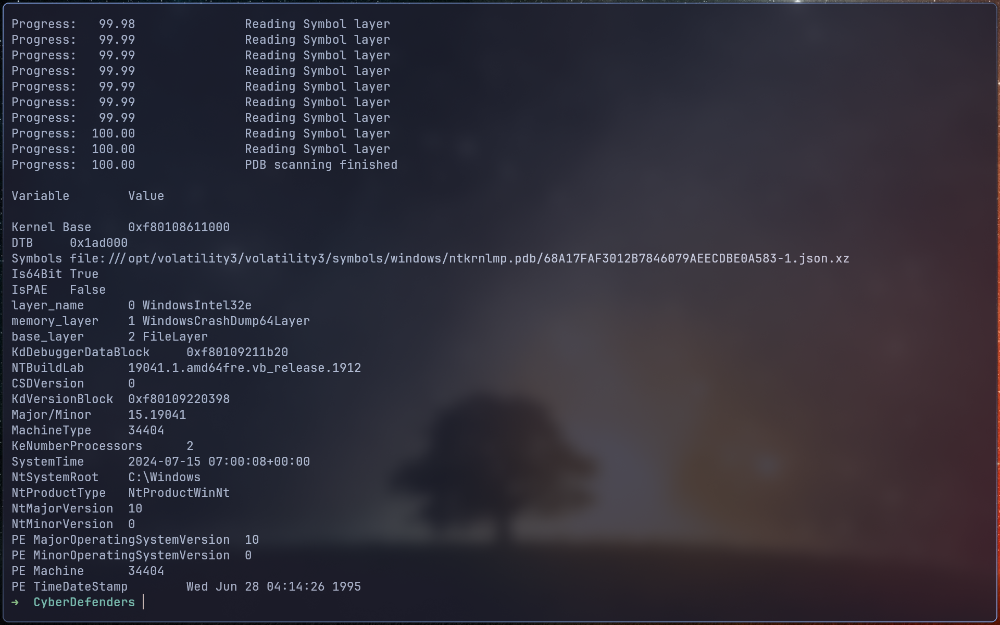
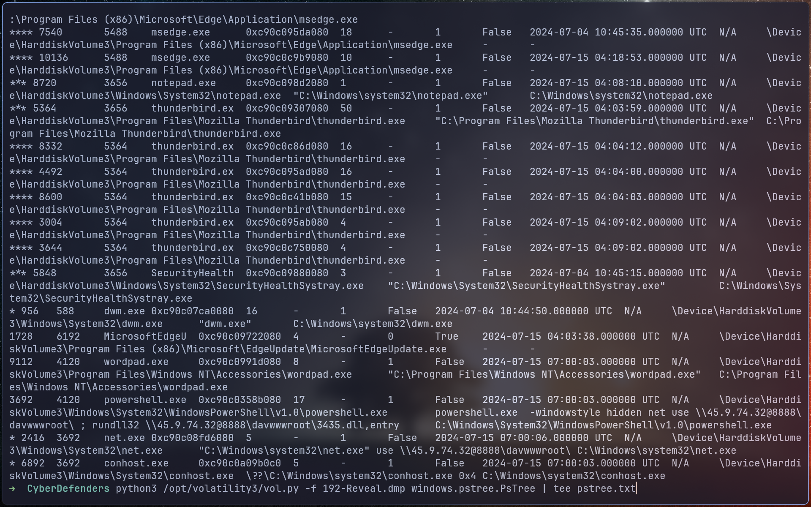
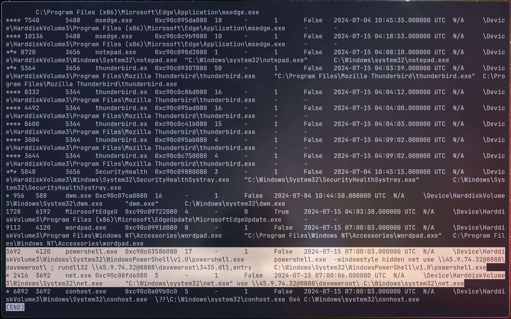
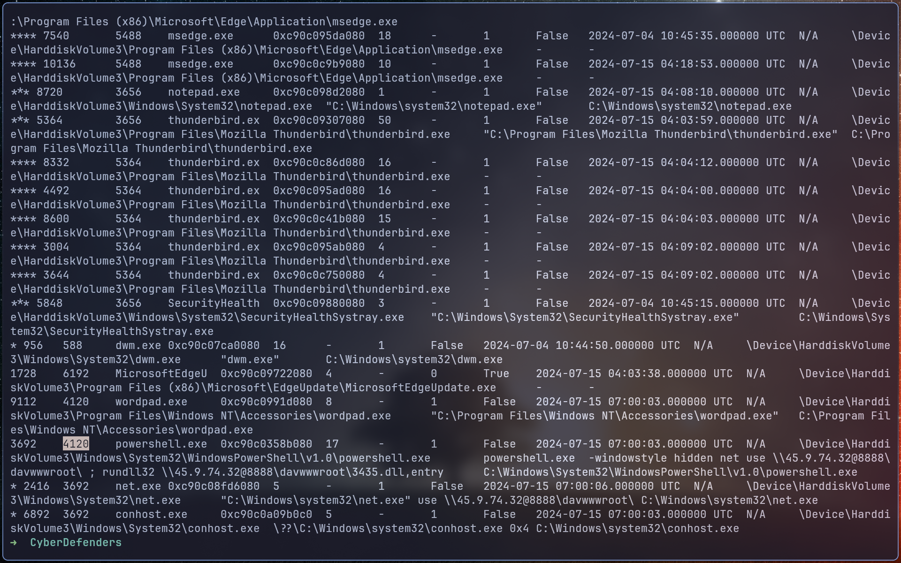
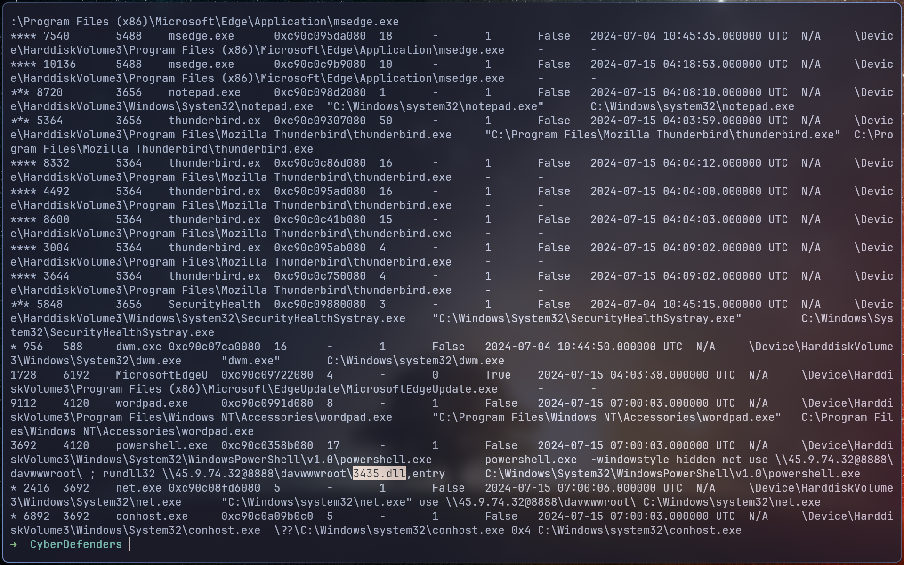
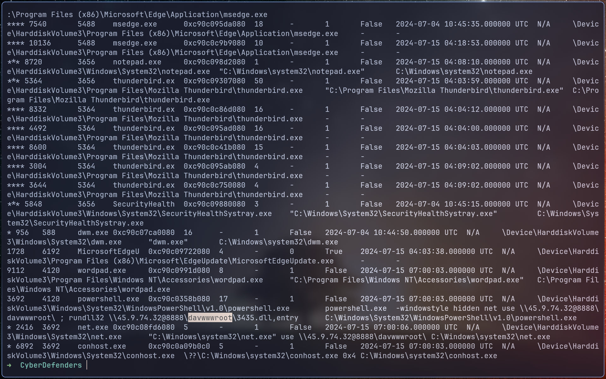
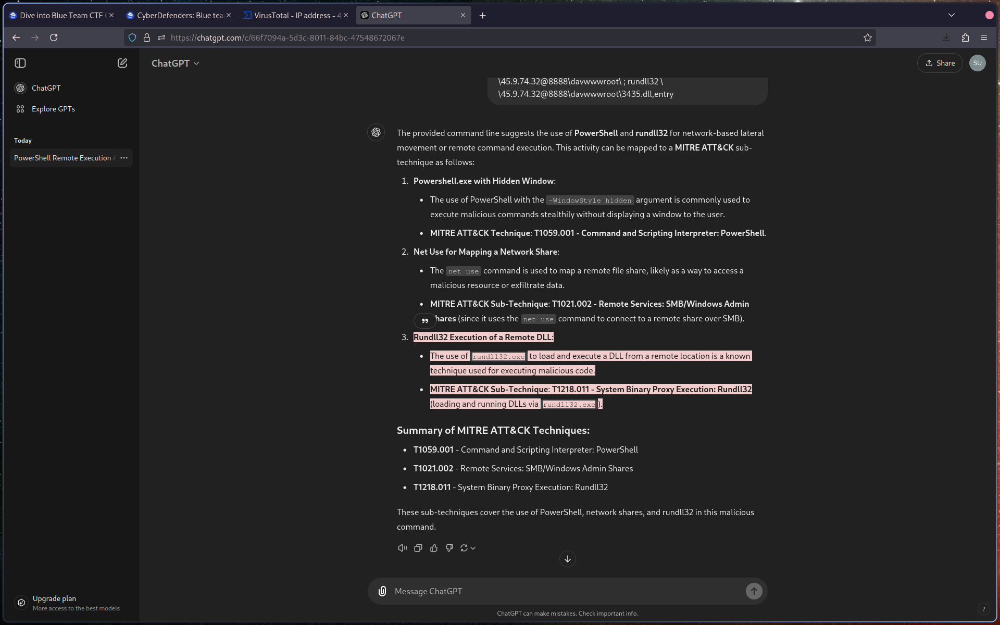
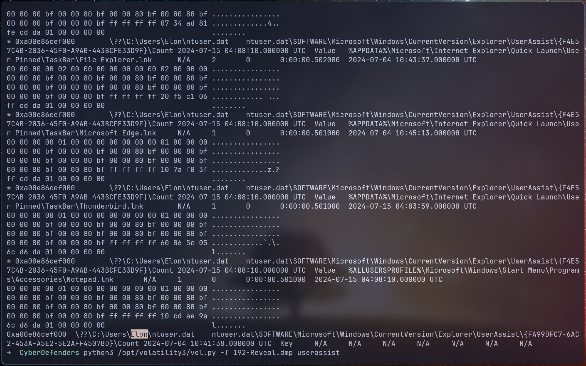
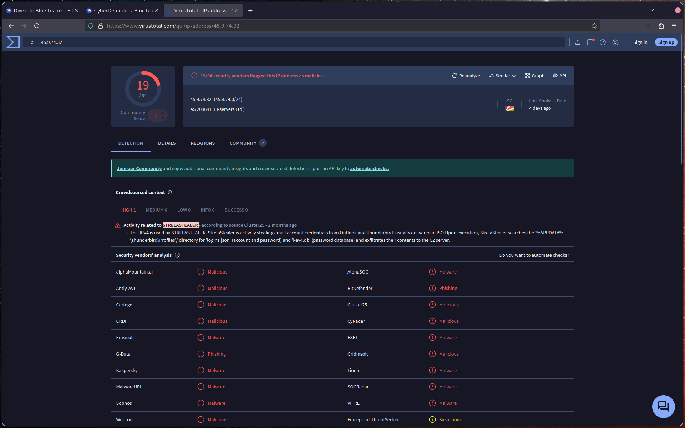

# Introduction

I always send volatility output command to files with tee.
It's better and quicker to parse after.
I start by using the windows.info plugins to have an overview :

# Q1: Identifying the name of the malicious process helps in understanding the nature of the attack. What is the name of the malicious process?

Let's start with Pstree :

This powershell part catch our eyes :

# Q2: Knowing the parent process ID (PPID) of the malicious process aids in tracing the process hierarchy and understanding the attack flow. What is the parent PID of the malicious process?

In the same output we can take the PPID :

# Q3: Determining the file name used by the malware for executing the second-stage payload is crucial for identifying subsequent malicious activities. What is the file name that the malware uses to execute the second-stage payload?

Again, we have the ddl :

# Q4: Identifying the shared directory on the remote server helps trace the resources targeted by the attacker. What is the name of the shared directory being accessed on the remote server?

And finally we have the directory as well :

# Q5: What is the MITRE sub-technique ID used by the malware to execute the second-stage payload?

This is the last question I answer, I just give it to Chatgpt :

# Q6: Identifying the username under which the malicious process runs helps in assessing the compromised account and its potential impact. What is the username that the malicious process runs under?

[Userassist plugin](https://volatility3.readthedocs.io/en/latest/_modules/volatility3/plugins/windows/registry/userassist.html) do the job pretty well :

# Q7: Knowing the name of the malware family is essential for correlating the attack with known threats and developing appropriate defenses. What is the name of the malware family?

Virustotal :

