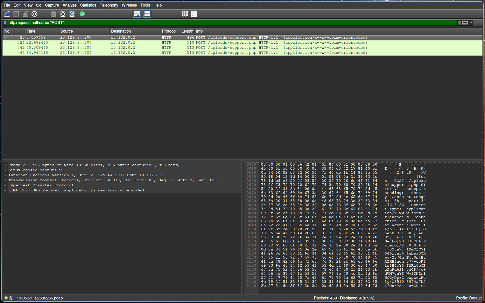
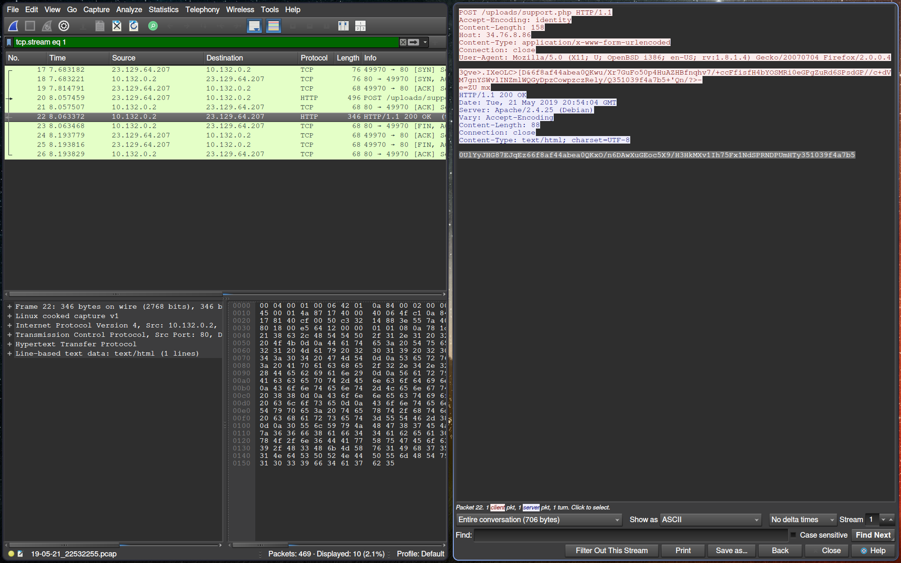
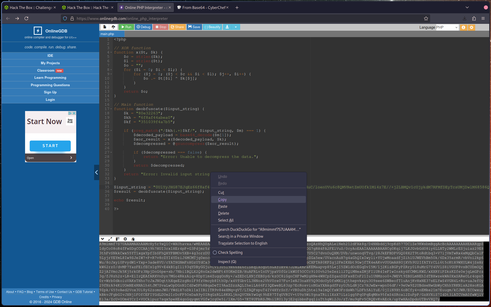
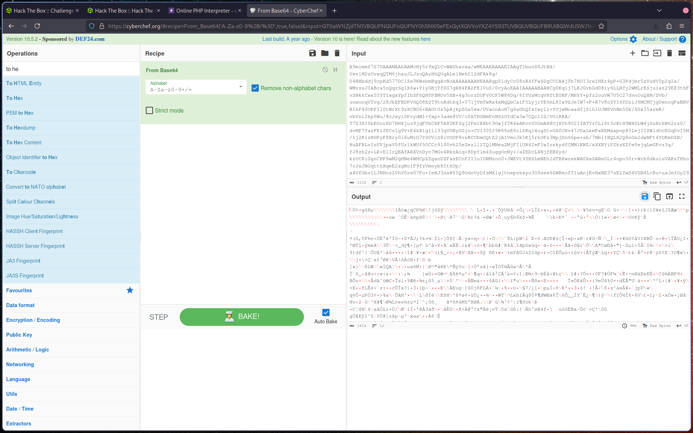
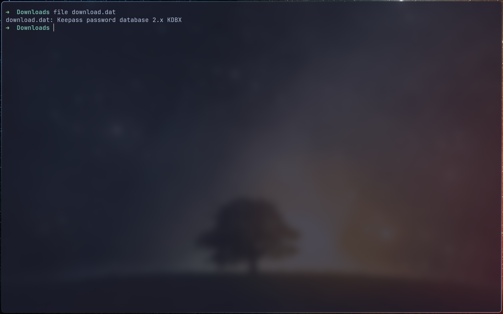
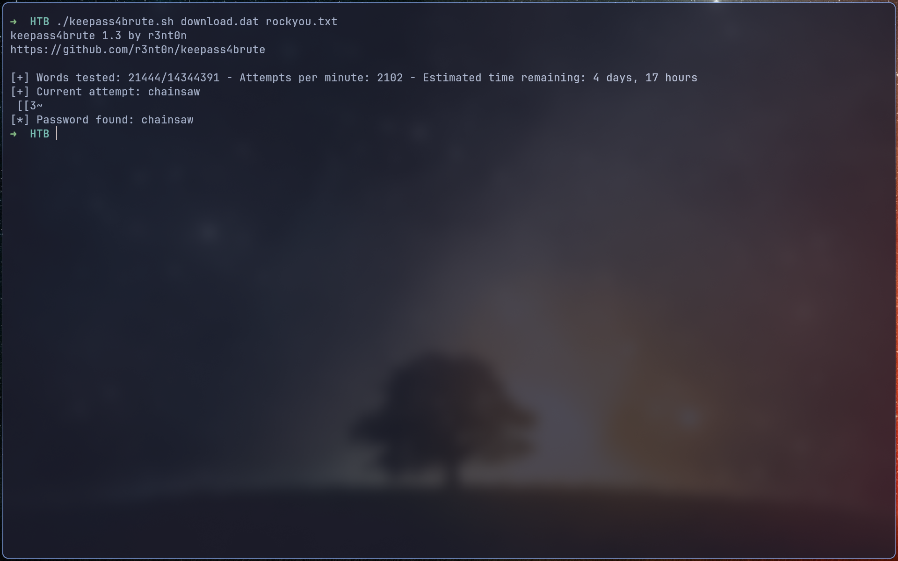
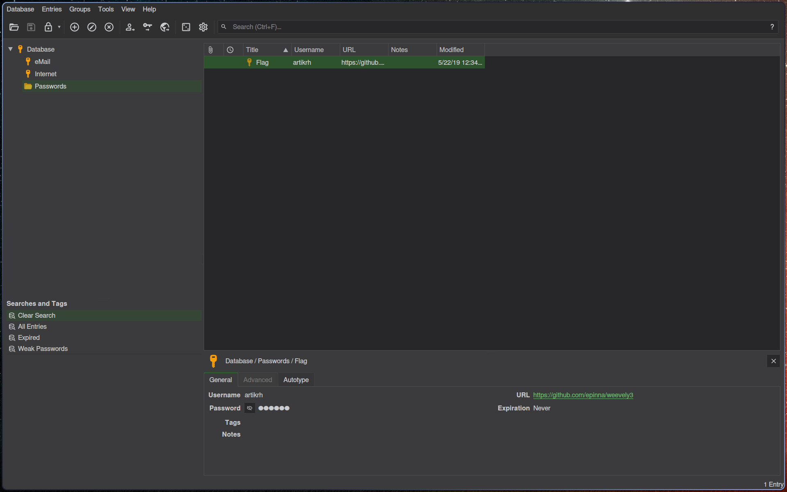

# Introduction

We have 2 files. A pcap and a php files.

# PCAP

I lookup the pcap before deobfuscate entirely the support.php
We filter for only POST method. We get only 4 entries.

If we follow the http stream we get weird entries like this : 0UlYyJHG87EJqEz66f8af44abea0QKxO/n6DAwXuGEoc5X9/H3HkMXv1Ih75Fx1NdSPRNDPUmHTy351039f4a7b5

# PHP

Let's go deobfuscate this. I use online gdb for execute the php code.
You can manually deobfuscate it. Or try to do it automatically with tool online or AI.
Once decoded (cf. script.php) the script want a input string.
Obviously we take strings from the pcap files which is send to the support.php
Here is the result :

Once decode, with cyberchef for example :

We download the file and check what is it :

# Keepassxc

We use [keepass4brute](https://github.com/r3nt0n/keepass4brute) with the standard [rockyou.txt](https://github.com/zacheller/rockyou):

And after 21444 attempts, we got the password and open the database:

