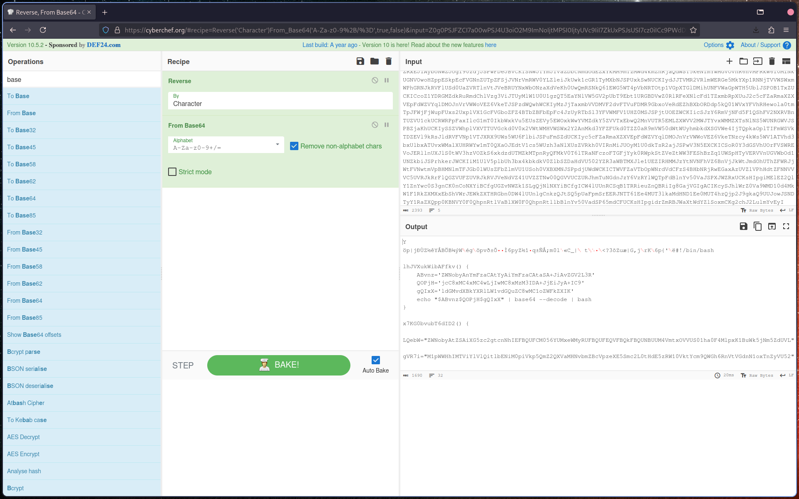
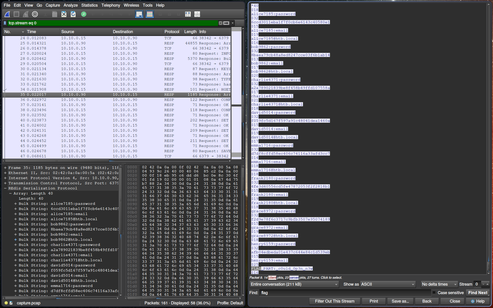
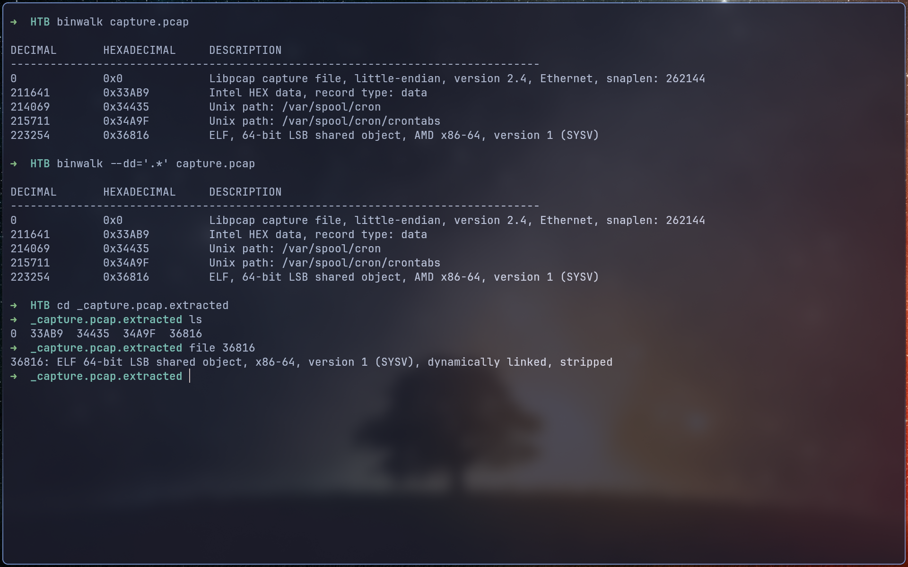
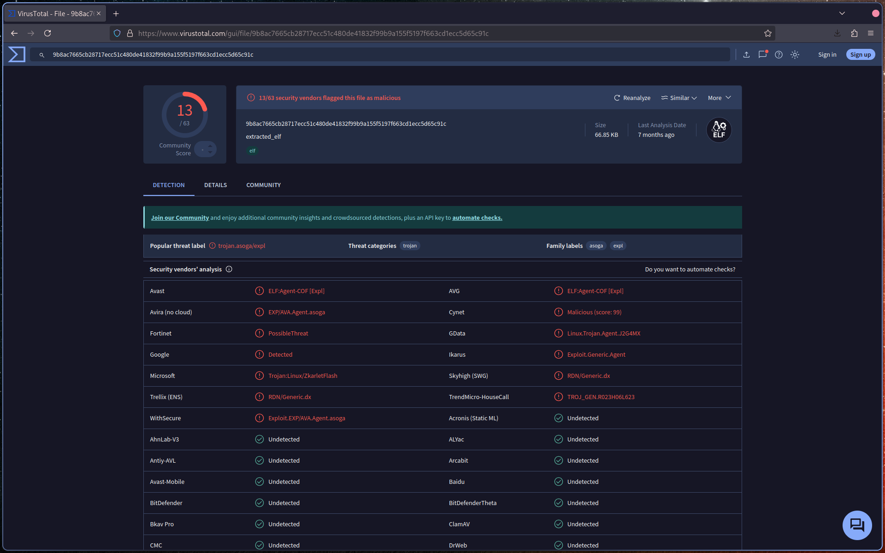

# Introduction

The flag is in 3 parts. I only find 2.
We have a pcap file. Let's go

# 1st part

He have only 2 http frames. The second one is heavy and contain interesting data. Load the data in CyberChef, reverse and decode base64.

I forget to make screenshots, so I make new one :

Once decoded we need to deobfuscate the bash script. I do it manually this time, check the deobfuscate.sh file. We have the first flag with the ssh-rsa key.

# 2nd part

I stuck a bit on this one.
The RESP protocol catch my eyes. I didn't know what it [is](https://redis.io/docs/latest/develop/reference/protocol-spec/)

So we follow the TCP stream and get the second part at the end :

Be careful for case sensitive. I spend some time because we don't know the flag format.

# 3rd part

I notice an elf file using binwalk :

It is flag as malicious on VT :

But didn't manage to get the last part.
