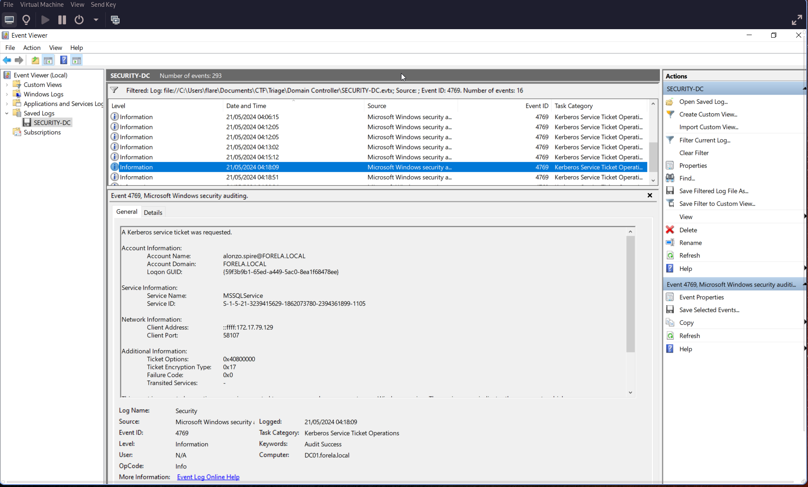
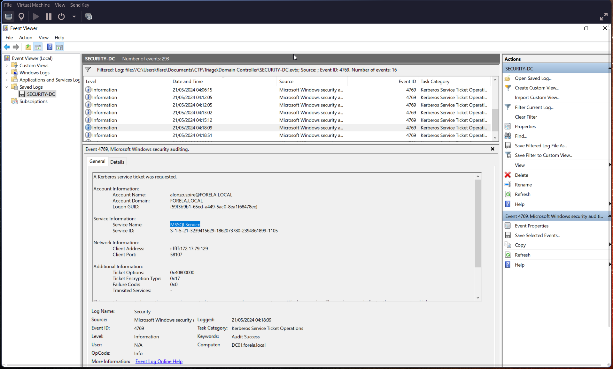
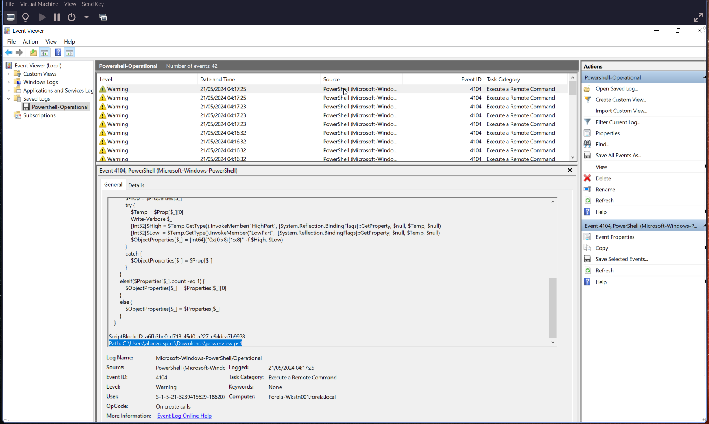
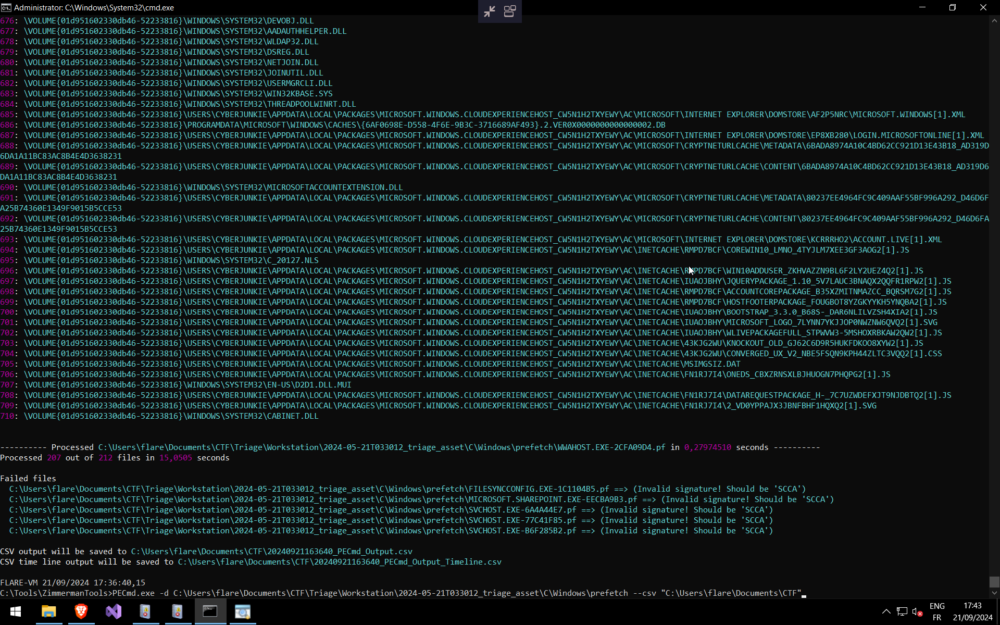
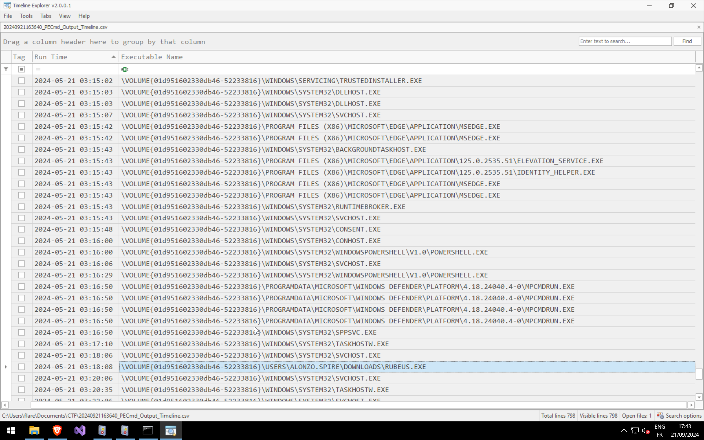

# Q1: Analyzing Domain Controller Security Logs, can you confirm the date & time when the kerberoasting activity occurred?

Let's open Event viewer on a Windows VM. We search with event id [4769](https://learn.microsoft.com/en-us/previous-versions/windows/it-pro/windows-10/security/threat-protection/auditing/event-4769). Don't forget to convert your local time to UTC format:

# Q2: What is the Service Name that was targeted?

Check the Service Name under Service Information:

# Q3: It is really important to identify the Workstation from which this activity occurred. What is the IP Address of the workstation?

We keep using the same event, with the Client Address line on Network Information section: 172.17.79.129

# Q4: Now that we have identified the workstation, a triage including PowerShell logs and Prefetch files are provided to you for some deeper insights so we can understand how this activity occurred on the endpoint. What is the name of the file used to Enumerate Active directory objects and possibly find Kerberoastable accounts in the network?

We check event id [4104](https://learn.microsoft.com/en-us/powershell/module/microsoft.powershell.core/about/about_logging_windows?view=powershell-7.4) and quickly find our file :

# Q5: When was this script executed?

I forget to take screenshot for this one.
We continue with the event id 4104. We convert the time in UTC : 2024-05-21 03:16:32

# Q6: What is the full path of the tool used to perform the actual kerberoasting attack?

It's time to use [PECmd](https://github.com/EricZimmerman/PECmd):

Now with our timeline in csv format we use Timeline Explorer from [EricZimmerman](https://github.com/EricZimmerman) too:

# Q7: When was the tool executed to dump credentials?

We have the answer in the previous screenshot with prefetch timeline csv output
