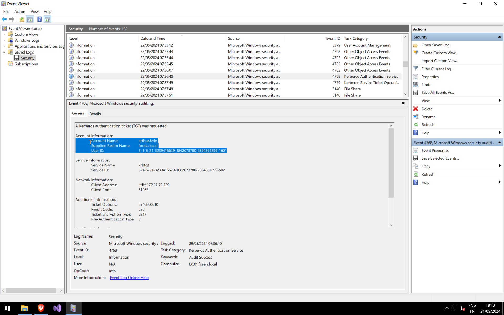
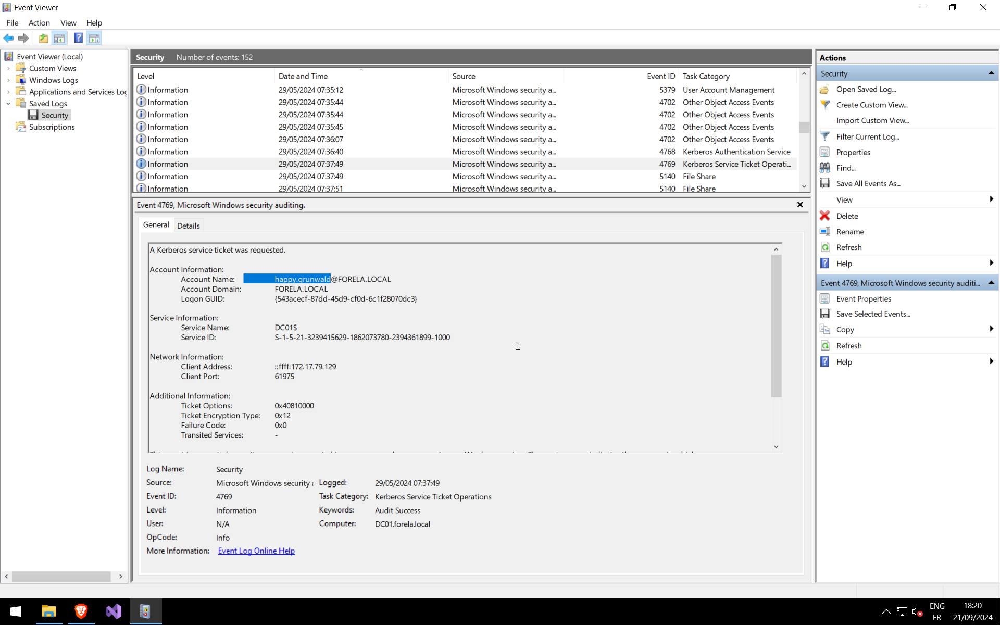

# Q1: When did the ASREP Roasting attack occur, and when did the attacker request the Kerberos ticket for the vulnerable user?

Let's open Event viewer on a Windows VM. We search with event id [4768](https://learn.microsoft.com/en-us/previous-versions/windows/it-pro/windows-10/security/threat-protection/auditing/event-4768), as required for a AS-REP-Roast attack. One event is weird. He is the only one with Pre-Authentification Type: 0.

# Q2: Please confirm the User Account that was targeted by the attacker.

It's on the same event, Account Information -> Account Name

# Q3: What was the SID of the account?

Same here, Account Information -> User ID

# Q4: It is crucial to identify the compromised user account and the workstation responsible for this attack. Please list the internal IP address of the compromised asset to assist our threat-hunting team.

Another one, Network Information -> Client Address

# Q5: We do not have any artifacts from the source machine yet. Using the same DC Security logs, can you confirm the user account used to perform the ASREP Roasting attack so we can contain the compromised account/s?

For this we need the [4769](https://learn.microsoft.com/en-us/previous-versions/windows/it-pro/windows-10/security/threat-protection/auditing/event-4769) event id, for Kerberos authentication, after the previous 4768 event. We find the name :

