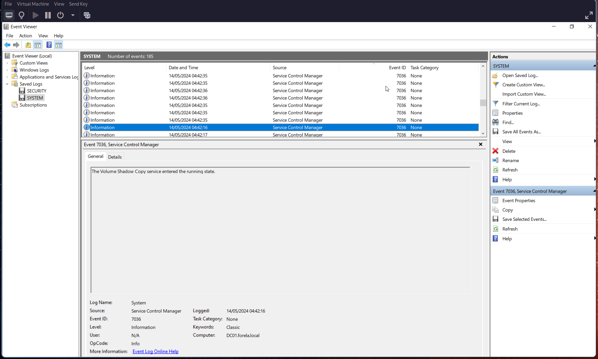
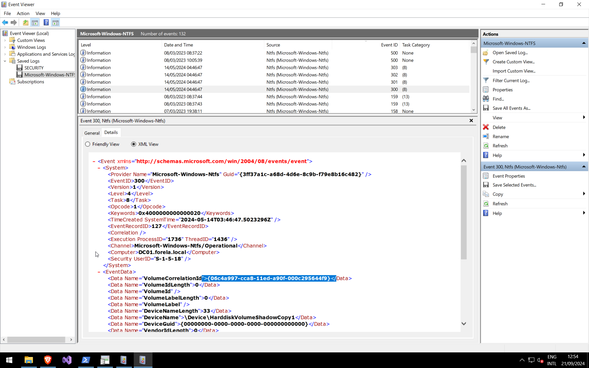
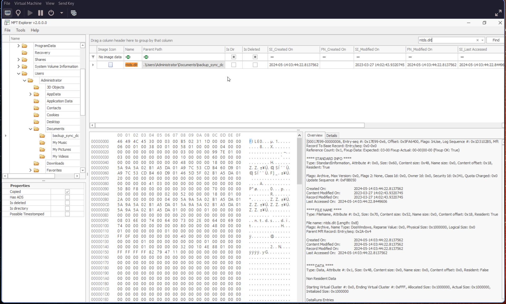
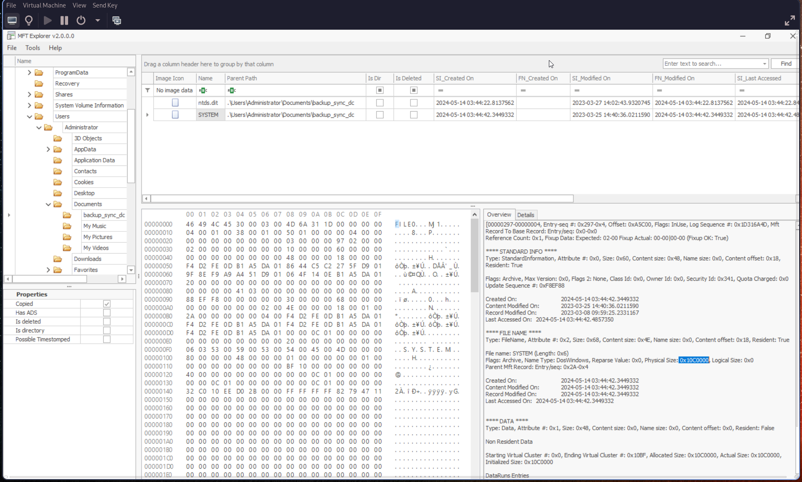

# Q1: Attackers can abuse the vssadmin utility to create volume shadow snapshots and then extract sensitive files like NTDS.dit to bypass security mechanisms. Identify the time when the Volume Shadow Copy service entered a running state.

We open the Security event id 7036 in SYSTEM.evtx file. We have the Volume shadow copy related event :

Convert the time in UTC

# Q2: When a volume shadow snapshot is created, the Volume shadow copy service validates the privileges using the Machine account and enumerates User groups. Find the User groups it enumerates, the Subject Account name, and also identify the Process ID(in decimal) of the Volume shadow copy service process

Let's search for event id [4799](https://learn.microsoft.com/en-us/previous-versions/windows/it-pro/windows-10/security/threat-protection/auditing/event-4799) with VSSVC.exe :

# Q3: Identify the Process ID (in Decimal) of the volume shadow copy service process.

We have the process id from the previous event, on Process ID field
Let's just convert 0x1190 in decimal.

# Q4: Find the assigned Volume ID/GUID value to the Shadow copy snapshot when it was mounted.

We need event id 300 related to ntfs.

# Q5: Identify the full path of the dumped NTDS database on disk.

We can just search "ntds.dit" on Autopsy :

# Q6: When was newly dumped ntds.dit created on disk?

From the previous question we can also retrieve the time with the Created On: field

# Q7: A registry hive was also dumped alongside the NTDS database. Which registry hive was dumped and what is its file size in bytes?

Within the same path as ntds.dit we have the SYSTEM database. Within Autopsy, the value is present in Overview tab :

