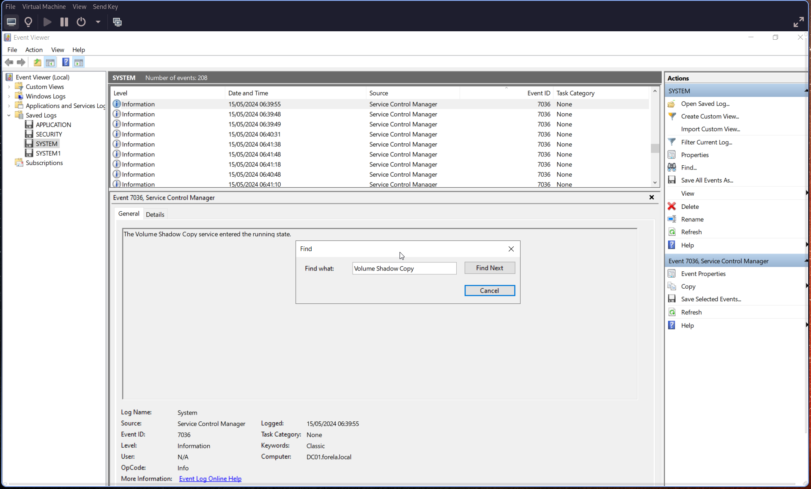
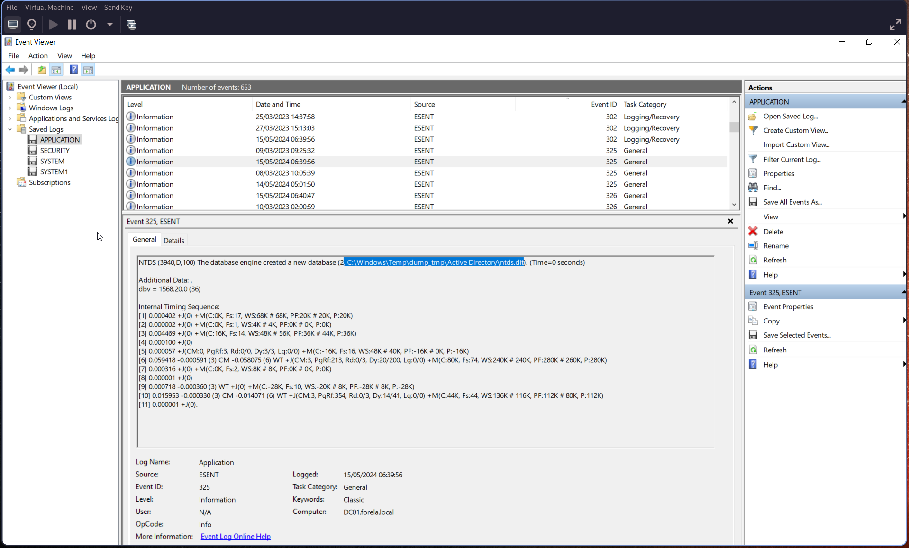
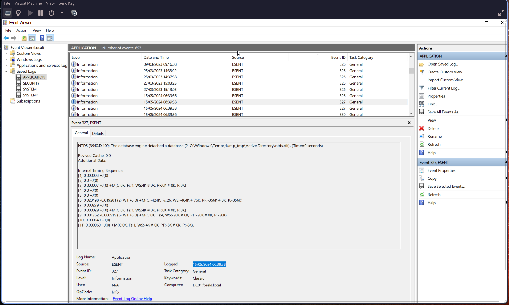
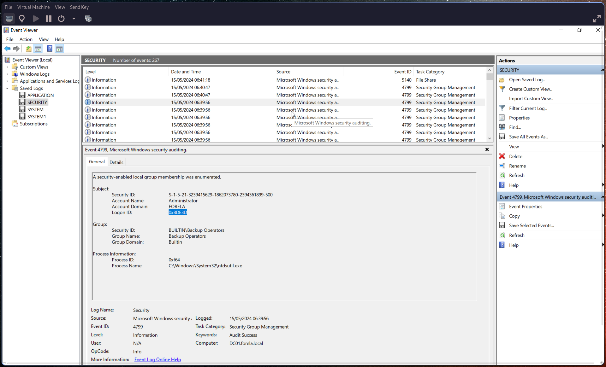
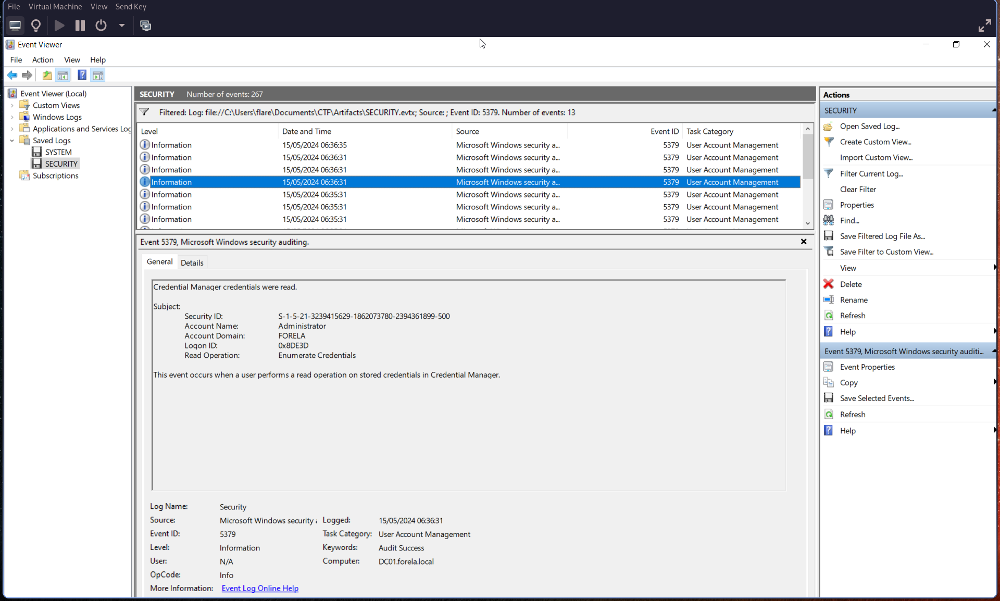

# Q1: When utilizing ntdsutil.exe to dump NTDS on disk, it simultaneously employs the Microsoft Shadow Copy Service. What is the most recent timestamp at which this service entered the running state, signifying the possible initiation of the NTDS dumping process?

So I basically do a Ctrl+F and find the famous Volume Shadow Copy. We get the timestamp on Logged: field :

# Q2: Identify the full path of the dumped NTDS file.

So we check [ESENT](https://learn.microsoft.com/en-us/troubleshoot/windows-server/performance/esent-event-327-326) event which are related to database. With this event id 325 we have "The database engine created a new database" followed by the path :

# Q3: When was the database dump created on the disk?

We get the timestamp with the previous question in the Logged: field

# Q4: When was the newly dumped database considered complete and ready for use?

I actually bruteforce this one, because i was stuck. It was an event id 327 with the "The database engine detached a database" :

# Q5: Event logs use event sources to track events coming from different sources. Which event source provides database status data like creation and detachment?

We already know this, the name ESENT is present on the Source column and on the Source: field of event.

# Q6: When ntdsutil.exe is used to dump the database, it enumerates certain user groups to validate the privileges of the account being used. Which two groups are enumerated by the ntdsutil.exe process? Also, find the Logon ID so we can easily track the malicious session in our hunt.

Let's search for event id [4799](https://learn.microsoft.com/en-us/previous-versions/windows/it-pro/windows-10/security/threat-protection/auditing/event-4799) with ntdsutil.exe :

# Q7: Now you are tasked to find the Login Time for the malicious Session. Using the Logon ID, find the Time when the user logon session started.

We have [5379](https://www.ultimatewindowssecurity.com/securitylog/encyclopedia/event.aspx?eventid=5379) event ids. We know, from the previous question, the logon ID and the two groups :

