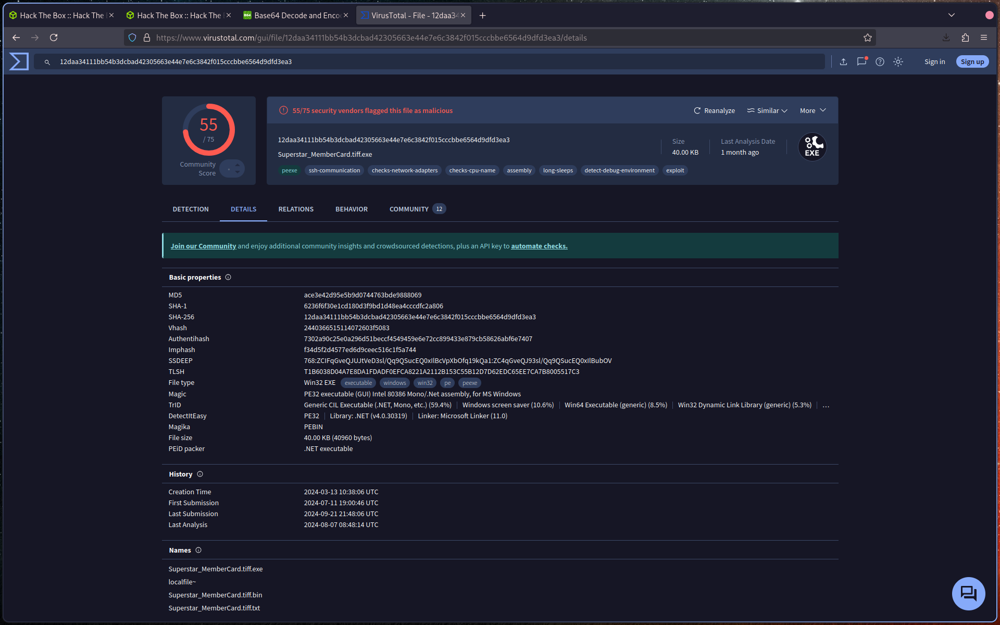
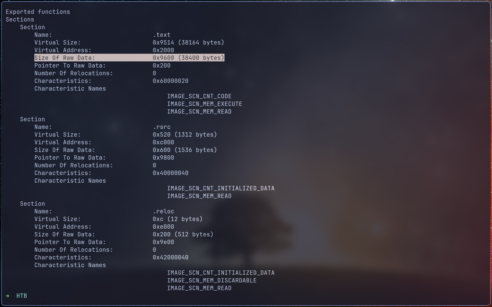
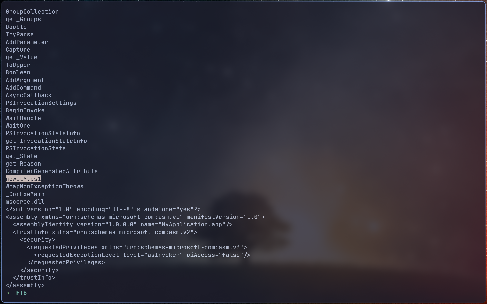
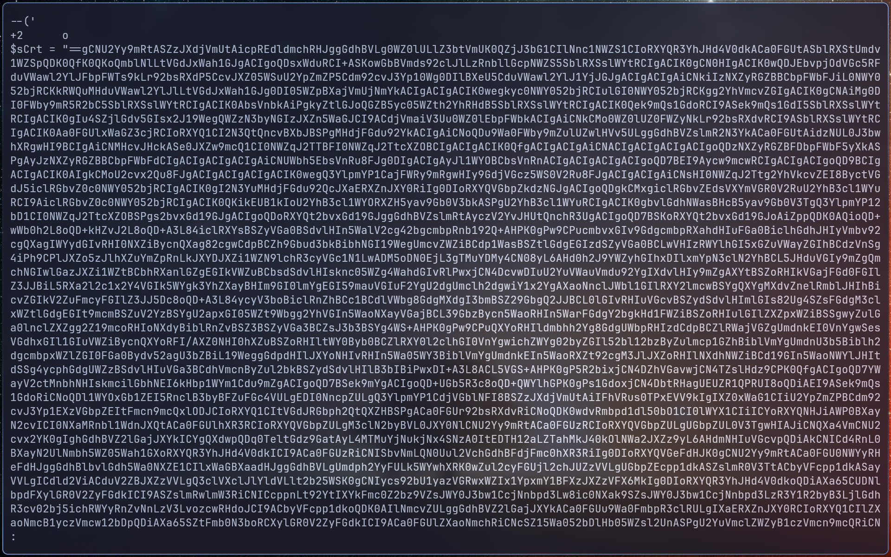
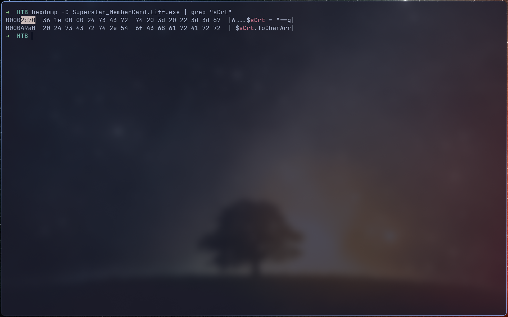
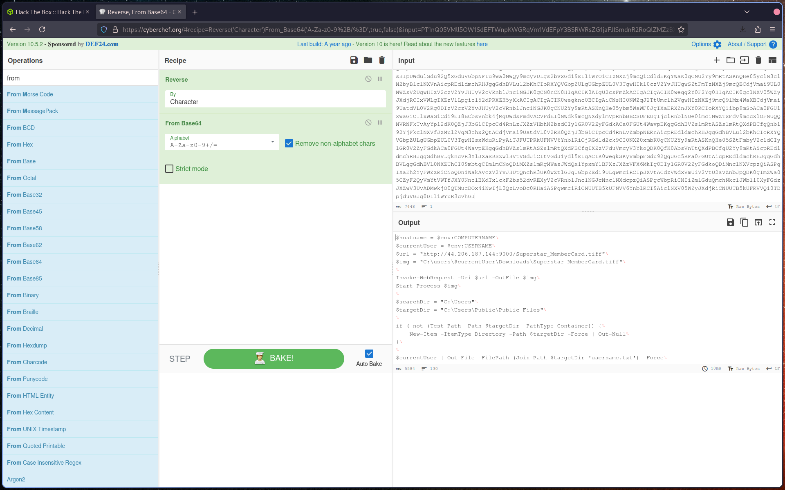
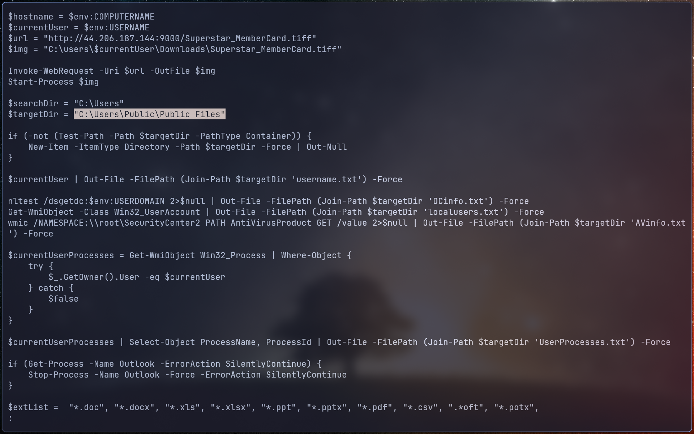
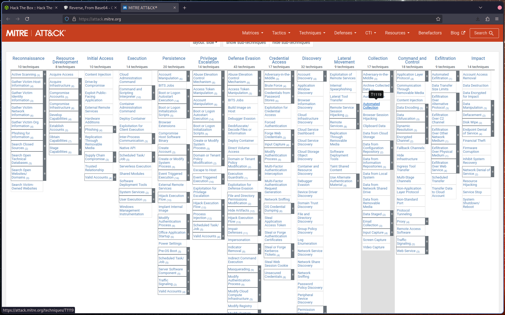
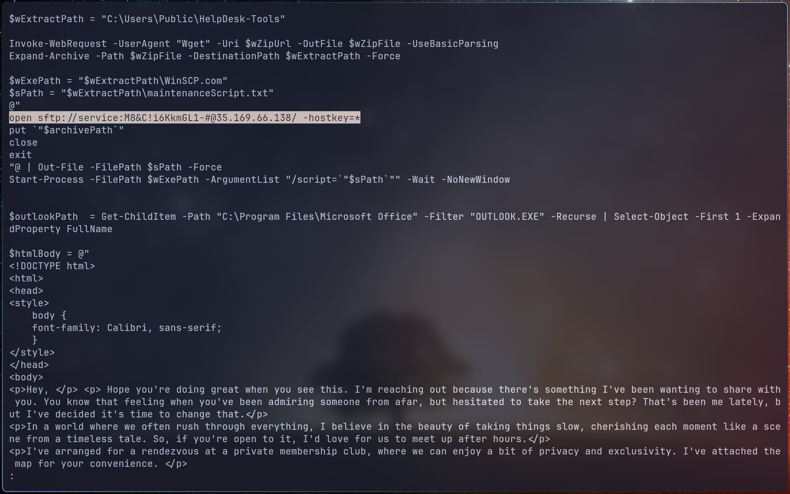

# Q1: To accurately reference and identify the suspicious binary, please provide its SHA256 hash.

12daa34111bb54b3dcbad42305663e44e7e6c3842f015cccbbe6564d9dfd3ea3  Superstar_MemberCard.tiff.exe

# Q2: When was the binary file originally created, according to its metadata (UTC)?

Enter the hash on VT:

# Q3: Examining the code size in a binary file can give indications about its functionality. Could you specify the byte size of the code in this binary?

I discover [readpe](https://github.com/mentebinaria/readpe):

# Q4: It appears that the binary may have undergone a file conversion process. Could you determine its original filename?

We can use strings to search for executable file. We quickly find newILY.ps1:

# Q5: Specify the hexadecimal offset where the obfuscated code of the identified original file begins in the binary.

We clearly discover the obfuscate code here:

Now we use hexdump to hunt for the offset:

# Q6: The threat actor concealed the plaintext script within the binary. Can you provide the encoding method used for this obfuscation?

On the previous question we can see this is Base64

# Q7: What is the specific cmdlet utilized that was used to initiate file downloads?

Once decoded we got this, the Invoke-WebRequest is as the start:

# Q8: Could you identify any possible network-related Indicators of Compromise (IoCs) after examining the code? Separate IPs by comma and in ascending order.

In the payload we have 2 ip address (Line 3 & 64)

# Q9: The binary created a staging directory. Can you specify the location of this directory where the harvested files are stored?

Check the $targetDir value:

# Q10: What MITRE ID corresponds to the technique used by the malicious binary to autonomously gather data?

Go to MITRE ATT&CK, go to Collection/Automated Collection:

# Q11: What is the password utilized to exfiltrate the collected files through the file transfer program within the binary?

At line 64 with the 2nd ip address we find the sftp password:

