# Q1: What action did Alex take to integrate the purported time-saving package into the deployment process? (provide the full command)

Into the classical powershell history file (ConsoleHost_history.txt), we find the nuget package installation :

# Q2: Identify the URL from which the package was downloaded ?

Checking Web History :
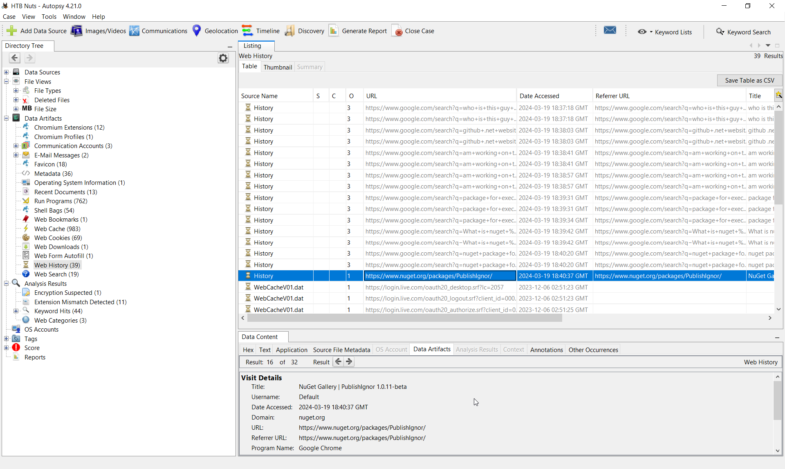

# Q3: Who is the threat actor responsible for publishing the malicious package? (the name of the package publisher)

We go to the nuget package website and find the author :
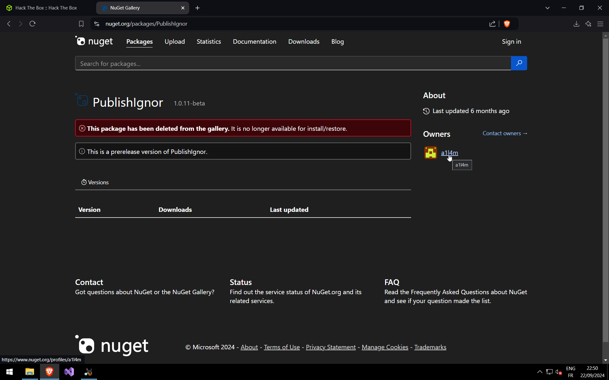

# Q4: When did the attacker initiate the download of the package? Provide the timestamp in UTC format (YYYY-MM-DD HH:MM)

Shellbags enter the chat :

# Q5: Despite restrictions, the attacker successfully uploaded the malicious file to the official site by altering one key detail. What is the modified package ID of the malicious package?

The ID term is quite confusing. It's my first time with nuget on forensics investigation. We quickly find the [.nuspec](https://learn.microsoft.com/en-us/nuget/reference/nuspec) file :
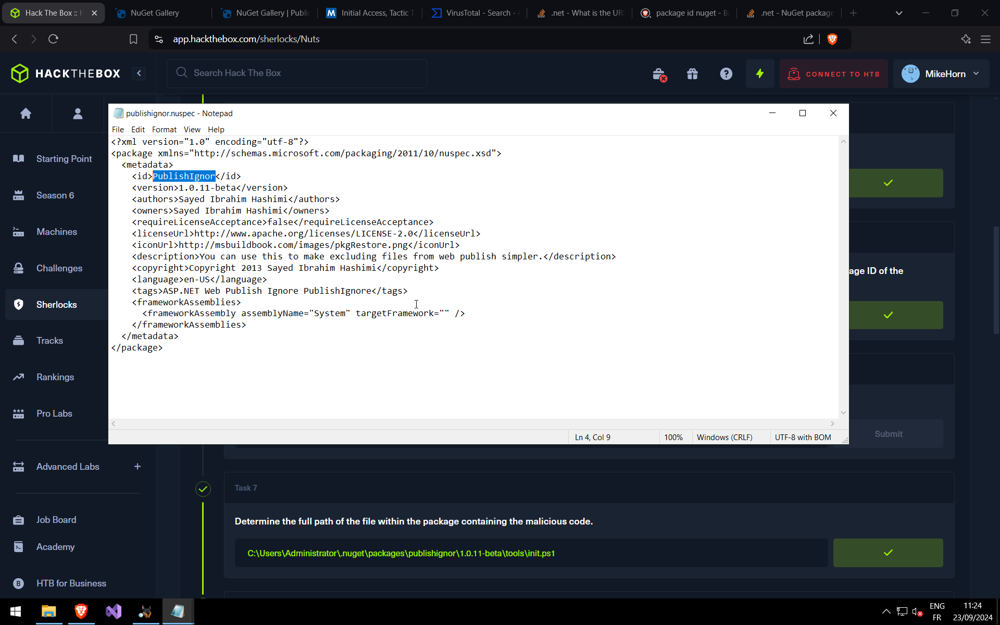

# Q6: Which deceptive technique did the attacker employ during the initial access phase to manipulate user perception? (technique name)

We clearly see that we want to replicate the PublishIgnore string by deleting the "e". It's typosquatting.

# Q7: Determine the full path of the file within the package containing the malicious code ?

Go to nuget default package location :
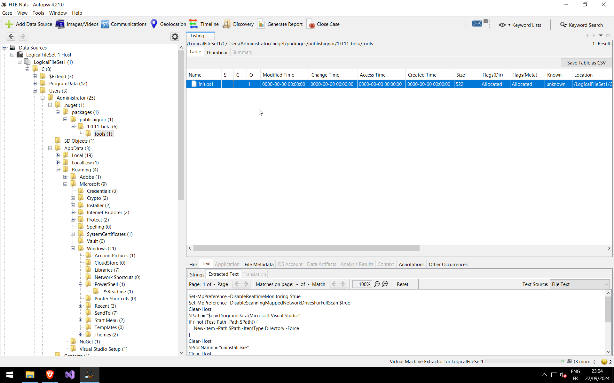

# Q8: When tampering with the system's security settings, what command did the attacker employ?

At the start of the init.ps1 found before, we have 2 interesting command at the start :
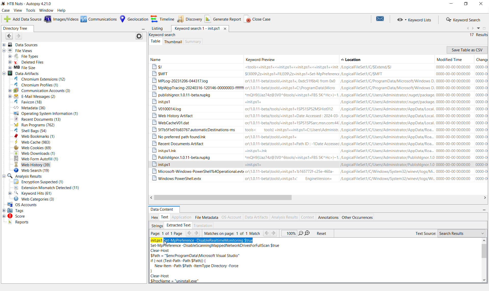

# Q9: Following the security settings alteration, the attacker downloaded a malicious file to ensure continued access to the system. Provide the SHA1 hash of this file

When reading the powershell script, we quickly see the uninstall.exe. I basically do a research of the exe file on Autopsy. We find our hash in the Windows Defender MP Microsoft Protection logs ([MPLog](https://www.thedfirspot.com/post/windows-defender-mp-logs-a-story-of-artifacts)) :
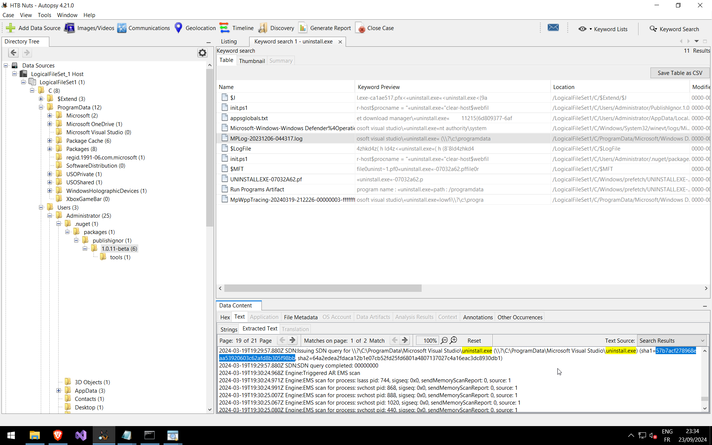

# Q10: Identify the framework utilised by the malicious file for command and control communication.

TDB

# Q11: At what precise moment was the malicious file executed?

It's Prefetch time. Let's use the classic combo [PECmd](https://github.com/EricZimmerman/PECmd) + [TimelineExplorer](https://www.sans.org/tools/timeline-explorer/) from Eric Zimmerman.
We parse the prefetch directory and export the timeline in csv :
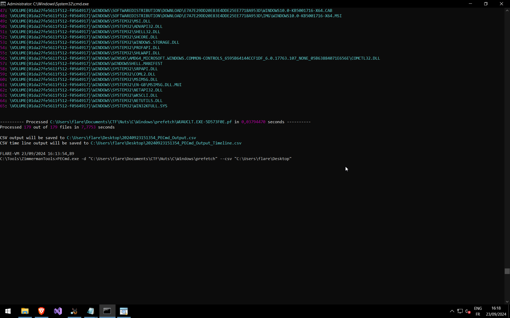
And now open in TimelineExplorer and search for our uninstall.exe :
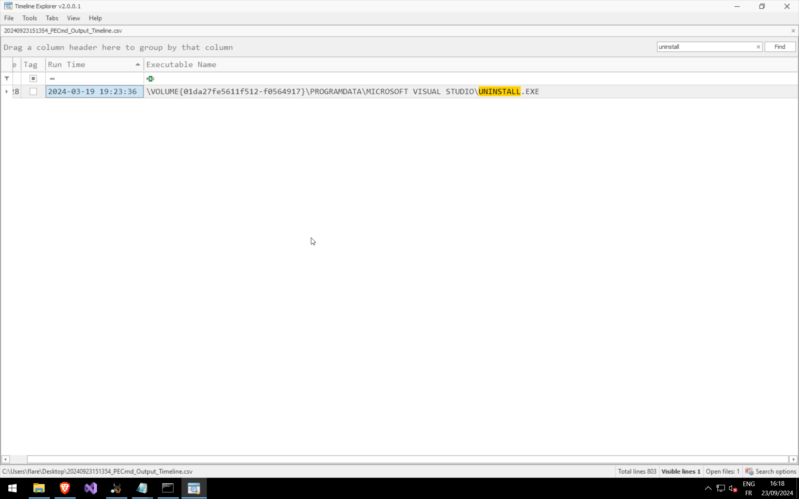

# Q12: The attacker made a mistake and didn’t stop all the features of the security measures on the machine. When was the malicious file detected? Provide the timestamp in UTC.

We check event id [1117](https://learn.microsoft.com/en-us/defender-endpoint/troubleshoot-microsoft-defender-antivirus#event-id-1117) in the Microsoft-Windos-Windows Defender%4Operational. With the research of string uninstall.exe from Q9 I have a hit on this file too :
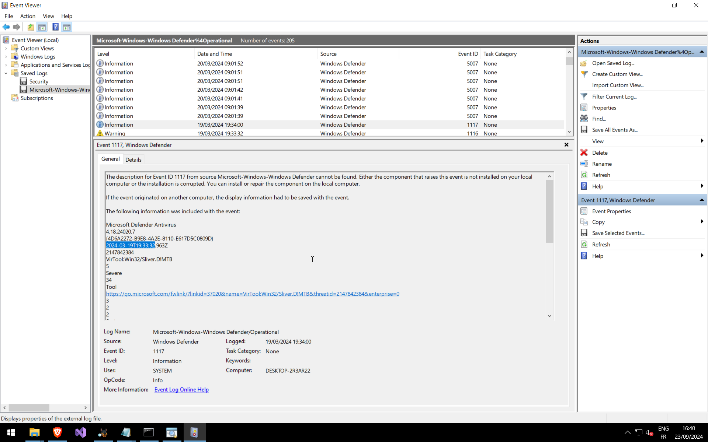

# Q13: After establishing a connection with the C2 server, what was the first action taken by the attacker to enumerate the environment? Provide the name of the process.

I go back to the prefetch timeline. Check just after Updater.exe, we find whoami :
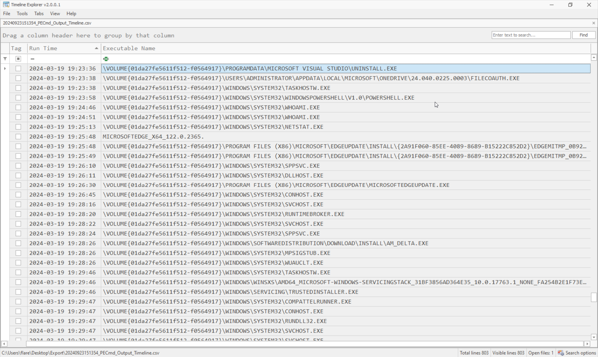

# Q14: To ensure continued access to the compromised machine, the attacker created a scheduled task. What is the name of the created task?

We go to the default path C:\Windows\System32\Taks and check unusual task.
MicrosoftSystemDailyUpdate is what we looking for.

# Q15: When was the scheduled task created? Provide the timestamp in UTC.

We open the xml file :
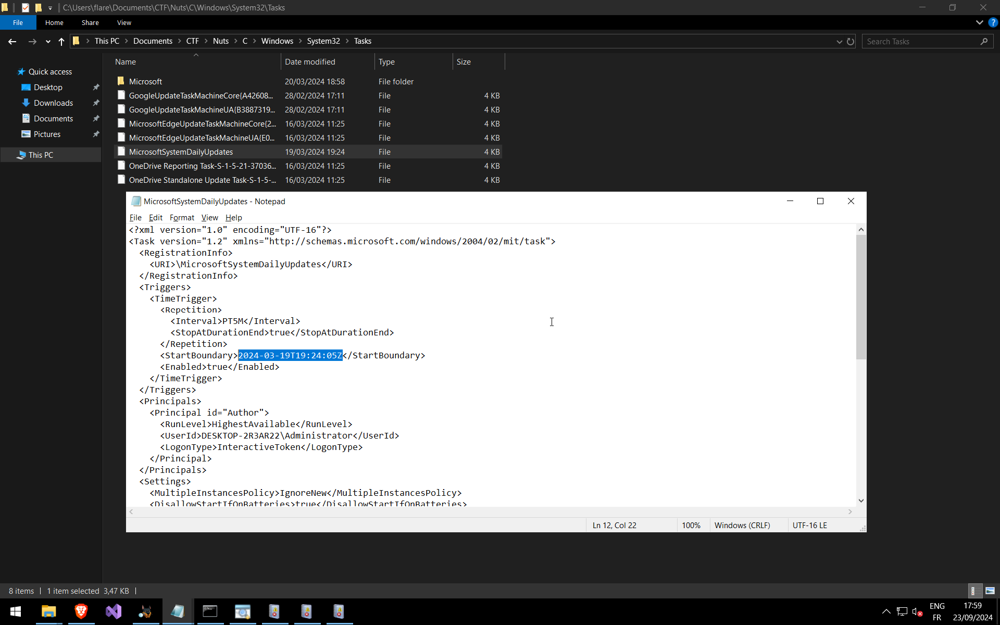

# Q16: Upon concluding the intrusion, the attacker left behind a specific file on the compromised host. What is the name of this file?

We find an unusual Updater.exe on C:\ProgramData. So I open the file on VT :
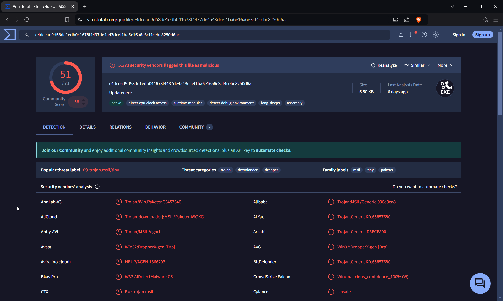

# Q17: As an anti-forensics measure. The threat actor changed the file name after executing it. What is the new file name?

TBD

# Q18: Identify the malware family associated with the file mentioned in the previous question (17).

The 3 family labels present on the main page not match. So I check in Community, and find in the last post.

# Q19: When was the file dropped onto the system? Provide the timestamp in UTC.

We open the [Master File Table](https://learn.microsoft.com/en-us/windows/win32/fileio/master-file-table) in Timeline explorer after using [MFTECmd](https://github.com/EricZimmerman/MFTECmd). Same process as PECmd from Q11. We search for Updater.exe :
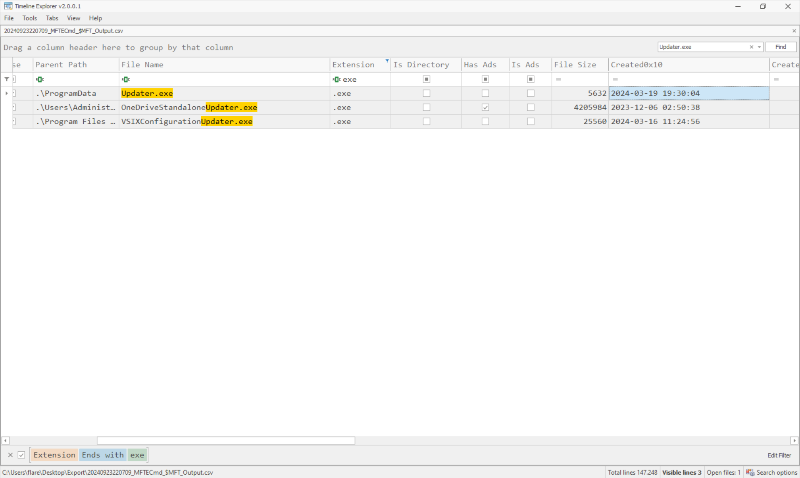
