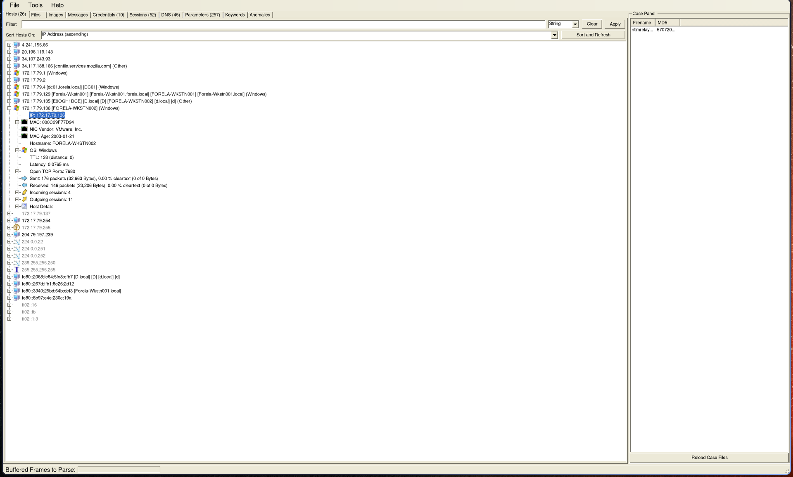
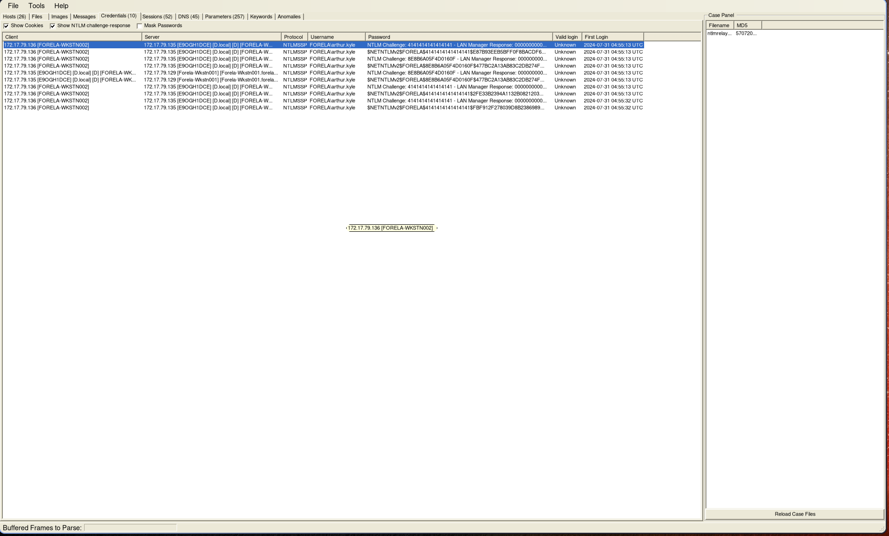
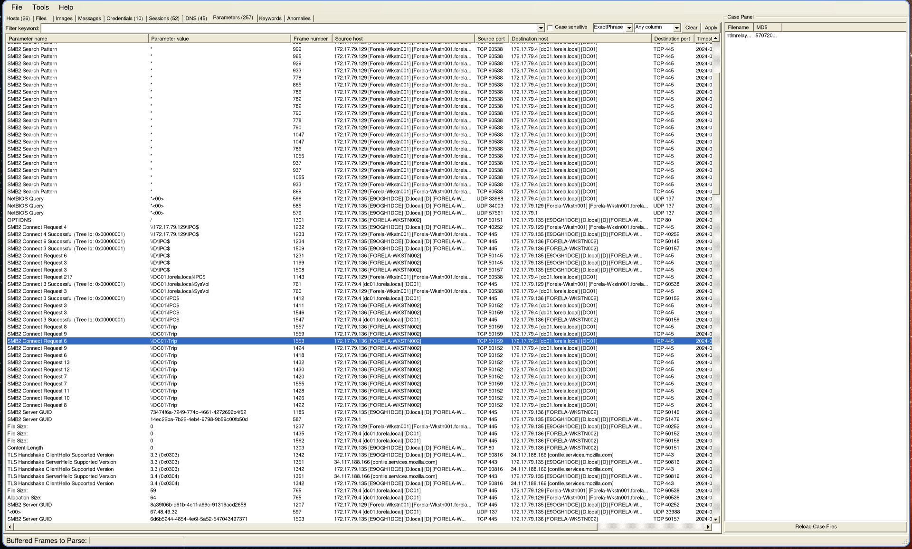
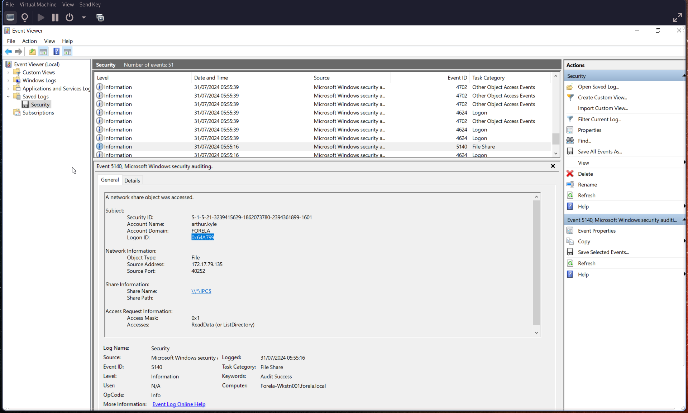
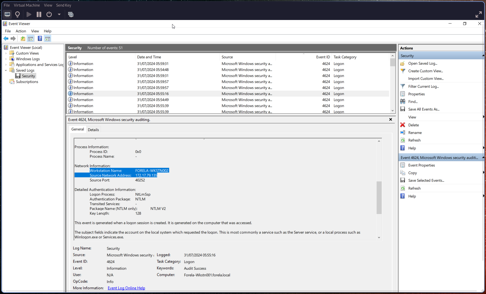

# Q1: What is the IP Address for Forela-Wkstn001?

# Q2: What is the IP Address for Forela-Wkstn002?

NetworkMiner need pcap files, so you can convert the pcapng to pcap :

```bash
tshark -F pcap -r ntlmrelay.pcapng -w ntlmrelay.pcap
```

Let's open NetworkMiner for an overview, we can answer both Q1 and Q2 :


# Q3: Which user account's hash was stolen by attacker?

# Q4: What is the IP Address of Unknown Device used by the attacker to intercept credentials?

With the Credentials tab we have the accounts and the IP :


# Q5: What was the fileshare navigated by the victim user account?

Now let's switch to Parameters tabs, looking for smb2 requests. We have only one dir :


# Q6: What is the source port used to logon to target workstation using the compromised account?

Go to Q7

# Q7: What is the Logon ID for the malicious session?

Switch to the security.evtx, we check the event id [5140](https://learn.microsoft.com/en-us/previous-versions/windows/it-pro/windows-10/security/threat-protection/auditing/event-5140) which is related to network share object was accessed. We got the Logon ID in hexadecimal and the source port for Q6 :


# Q8: The detection was based on the mismatch of hostname and the assigned IP Address. What is the workstation name and the source IP Address from which the malicious logon occur?

Go to Q9

# Q9: When did the malicious logon happened. Please make sure the timestamp is in UTC?

Event id [4624](https://learn.microsoft.com/en-us/previous-versions/windows/it-pro/windows-10/security/threat-protection/auditing/event-4624) is related to logon.
One event catch our eyes, he have Logon ID to 0x0 and Security ID to NULL.
He also match our user arthur kyle. We have the timestamp at the Logged value and the workstation name & ip address :


# Q10: What is the share Name accessed as part of the authentication process by the malicious tool used by the attacker?

We can use the previous event id 5140 from Q6/Q7, with the Share Name value.
